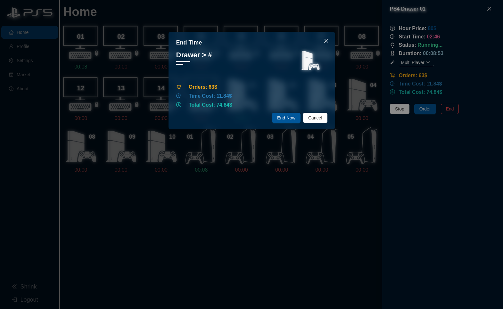
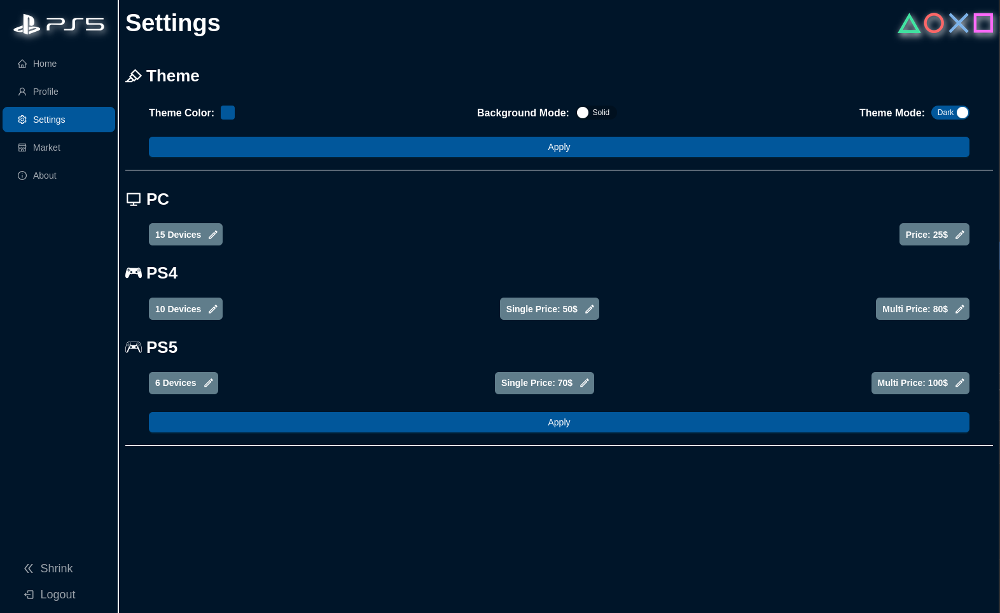
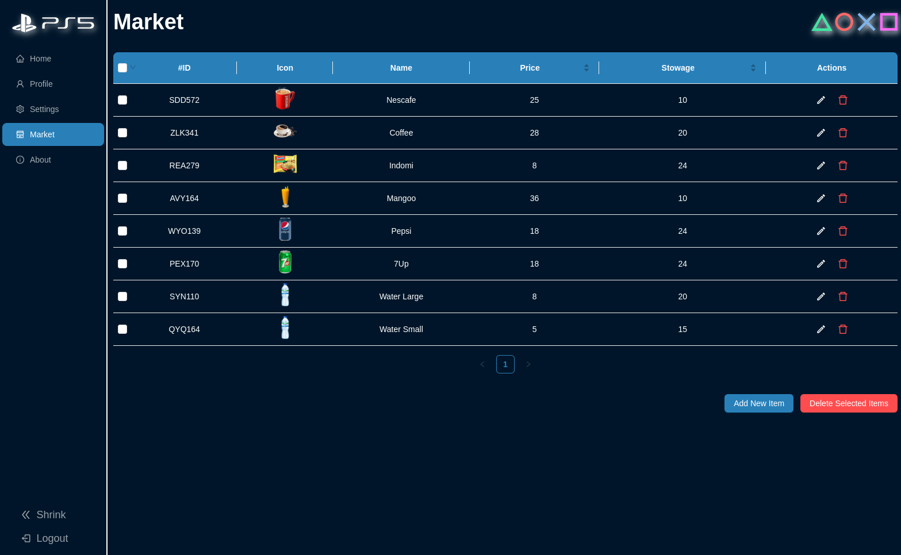

# 🎮 Games Wave

**Games Wave** is a **MERN Stack web application** designed to help **Internet cafe owners manage gaming devices, sessions, and market orders efficiently**.

It provides real-time control of PCs and PlayStations (PS4 / PS5), calculates session costs automatically, and allows cafés to manage drinks and other orders through a built-in market system.

---

# 📸 Screenshots






---

# 🚀 Features

## 🖥 Device Management
- Control and monitor multiple devices such as:
  - **PCs**
  - **PlayStation 4**
  - **PlayStation 5**
- Example devices: `PC1`, `PC2`, `PS4-1`, `PS5-1`
- Start and end gaming sessions easily.

---

## 💰 Automatic Cost Calculation

Session cost is calculated dynamically based on:

1. **Device Type**
   - PC
   - PS4
   - PS5

2. **Play Mode (PlayStation)**
   - Single Player
   - Multiplayer

3. **Market Orders**
   - Drinks
   - Snacks
   - Other items

---

## 🛒 Market System
- Manage café products such as:
  - Drinks
  - Snacks
  - Other items
- Add orders to active gaming sessions.
- Automatically include order prices in the final session bill.

---

## 📧 Email Verification
- Secure user authentication with **email verification**
- Emails are sent using **Nodemailer**

---

## ⚡ Real-time Session Management
- Start and stop sessions
- Track session time
- Calculate the final bill automatically

---

# 🛠 Tech Stack

## Frontend
- React
- Vite
- Axios

## Backend
- Node.js
- Express.js
- MongoDB
- Mongoose

## Other Tools
- Nodemailer
- Concurrently

---


# ⚙️ Installation

Clone the repository:

```bash
git clone https://github.com/Yousef-Alaa/Games-Wave.git
cd Games-Wave
```

Install dependencies for both backend and frontend:

```bash
npm install && npm install --prefix frontend
```

---

# ▶️ Running the Project

### Run Full Development Environment

Starts both the **backend server** and **frontend development server** at the same time.

```bash
npm run dev
```

---

### Run Backend Only

Starts the backend server in development mode with **auto-restart when files change**.

```bash
npm run server
```

---

### Run Frontend Only

Starts the React development server.

```bash
npm run client
```

---

# 📦 Build Project

Installs dependencies and builds the frontend for production.

```bash
npm run build
```

---

# 🔐 Environment Variables

Create a `.env` file in the root directory and add the following variables:

```
PORT=App_Port
MONGO_URI=your_mongodb_connection_string

NODE_ENV = development or production
CLIENT_URL = 'http://localhost:4444' or 'https://games-wave.vercel.app/' in production
JWT_SECRET = your_jwt_secret


MAIL_SERVICE = mail_service_provider
MAIL_HOST = mail_service_provider_host
MAIL_PORT = mail_service_provider_port

MAIL_USER = your_email
MAIL_PASS = your_email_password

```

---

# 📂 Project Structure

```
Games-Wave/
├── backend
│   ├── controllers
│   │   ├── marketController.js
│   │   └── usersController.js
│   ├── middlewares
│   │   ├── auth.js
│   │   ├── error.js
│   │   ├── imageUpload.js
│   │   └── logger.js
│   ├── models
│   │   ├── marketModel.js
│   │   ├── unitsModel.js
│   │   └── usersModel.js
│   ├── routes
│   │   ├── marketRoute.js
│   │   ├── unitsRoute.js
│   │   └── usersRoute.js
│   ├── server.js
│   ├── uploads
│   │   ├── icons
│   │   │   ├── bootstrap.png
│   │   │   ├── IMG1.jpg
│   │   │   ├── IMG2.jpg
│   │   │   ├── javascript.png
│   │   │   ├── jquery.png
│   │   │   ├── logo.png
│   │   │   ├── noun-computer-12565.svg
│   │   │   └── photo-151.jpg
│   │   └── profile
│   │       ├── bootstrap.png
│   │       ├── git.png
│   │       ├── images(7)1.jpg
│   │       ├── images(7).jpg
│   │       ├── IMG2.jpg
│   │       ├── javascript.png
│   │       ├── logo.png
│   │       ├── pexels5.png
│   │       ├── pexels.png
│   │       ├── photo-152.jpg
│   │       └── tailwind.png
│   └── utils
│       ├── apiError.js
│       ├── db.js
│       ├── defaultUnits.js
│       ├── fakeData.js
│       ├── generateUID.js
│       ├── icon.png
│       ├── mailTemplates.js
│       ├── sendMail.js
│       └── token.js
├── frontend
│   ├── index.html
│   ├── package.json
│   ├── package-lock.json
│   ├── public
│   │   ├── application
│   │   │   └── win-setup.exe
│   │   ├── favicon.svg
│   │   ├── images
│   │   │   ├── marketicons
│   │   │   │   ├── 7up.png
│   │   │   │   ├── apple.png
│   │   │   │   ├── coffee.png
│   │   │   │   ├── indomi.png
│   │   │   │   ├── mango-juice.png
│   │   │   │   ├── mirnda-orange.png
│   │   │   │   ├── nescafe.png
│   │   │   │   ├── orange-juice.png
│   │   │   │   ├── pepsi.png
│   │   │   │   ├── tea.png
│   │   │   │   └── water.png
│   │   │   ├── New
│   │   │   │   ├── console-filled.svg
│   │   │   │   ├── console-solid.svg
│   │   │   │   ├── console-with-gamepad.svg
│   │   │   │   ├── gaming-remotes.svg
│   │   │   │   ├── gaming-remote.svg
│   │   │   │   ├── icons8-playstation-500.svg
│   │   │   │   ├── icons8-playstation-50.svg
│   │   │   │   ├── logo-short.svg
│   │   │   │   ├── noun-dualshock-4-4574681.svg
│   │   │   │   ├── noun-gamepad-979915.svg
│   │   │   │   ├── noun-playstation-5-4595532.svg
│   │   │   │   ├── noun-playstation-5-4783626.svg
│   │   │   │   ├── noun-video-game-controller-63218.svg
│   │   │   │   ├── PS4.svg
│   │   │   │   ├── ps5.svg
│   │   │   │   ├── shapes.png
│   │   │   │   └── white.png
│   │   │   └── profile_default.jpg
│   ├── README.md
│   ├── src
│   │   ├── App.jsx
│   │   ├── App.scss
│   │   ├── assets
│   │   │   ├── 404.svg
│   │   │   ├── console-with-gamepad.svg
│   │   │   ├── icons
│   │   │   │   ├── ps4-controller.svg
│   │   │   │   └── ps5-controller.svg
│   │   │   ├── no-devices.svg
│   │   │   ├── no-market.svg
│   │   │   ├── no-reports.svg
│   │   │   ├── not used
│   │   │   │   ├── 3973477.svg
│   │   │   │   ├── logo.svg
│   │   │   │   ├── PC-Icon.svg
│   │   │   │   ├── PC-old.svg
│   │   │   │   ├── play-solid.svg
│   │   │   │   ├── playstation-5-slim.svg
│   │   │   │   ├── PS4.svg
│   │   │   │   └── PS5.svg
│   │   │   ├── PC.svg
│   │   │   ├── playstation-5.svg
│   │   │   ├── PlayStation-Small.svg
│   │   │   ├── PlayStation.svg
│   │   │   ├── shapes.png
│   │   │   └── welcome.svg
│   │   ├── componenets
│   │   │   ├── DrawerContent.jsx
│   │   │   ├── EditMarketItem.jsx
│   │   │   ├── Loading.jsx
│   │   │   ├── NewMarketItem.jsx
│   │   │   ├── PagesHead.jsx
│   │   │   ├── ProtectedRoute.jsx
│   │   │   ├── SideBar.jsx
│   │   │   ├── Unit.jsx
│   │   │   └── UnitsConfig.js
│   │   ├── main.jsx
│   │   ├── redux
│   │   │   ├── auth
│   │   │   │   ├── authServices.js
│   │   │   │   └── authSlice.js
│   │   │   ├── merketApi.js
│   │   │   ├── store.js
│   │   │   ├── themeSlice.js
│   │   │   ├── timeManager.js
│   │   │   └── unitsSlice.js
│   │   └── routes
│   │       ├── index.jsx
│   │       └── pages
│   │           ├── 404.jsx
│   │           ├── About.jsx
│   │           ├── ForgotPassword.jsx
│   │           ├── Home.jsx
│   │           ├── Login.jsx
│   │           ├── Market.jsx
│   │           ├── Profile.jsx
│   │           ├── ResetPassword.jsx
│   │           ├── Settings.jsx
│   │           ├── SignUp.jsx
│   │           └── VerifyEmail.jsx
│   └── vite.config.js
├── package.json
├── package-lock.json
└── README.md

```

---


💡 **Games Wave helps internet cafe's manage devices, sessions, and orders in one modern system.**